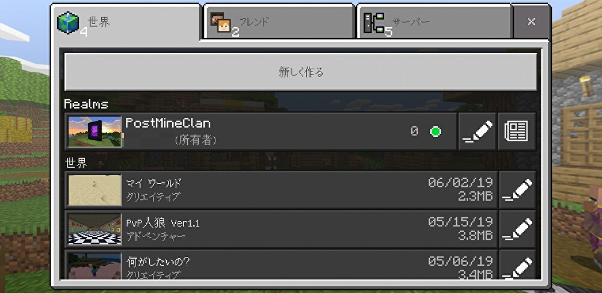
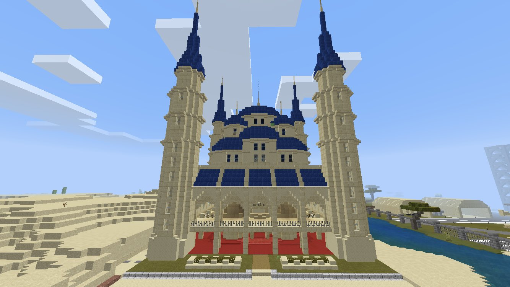
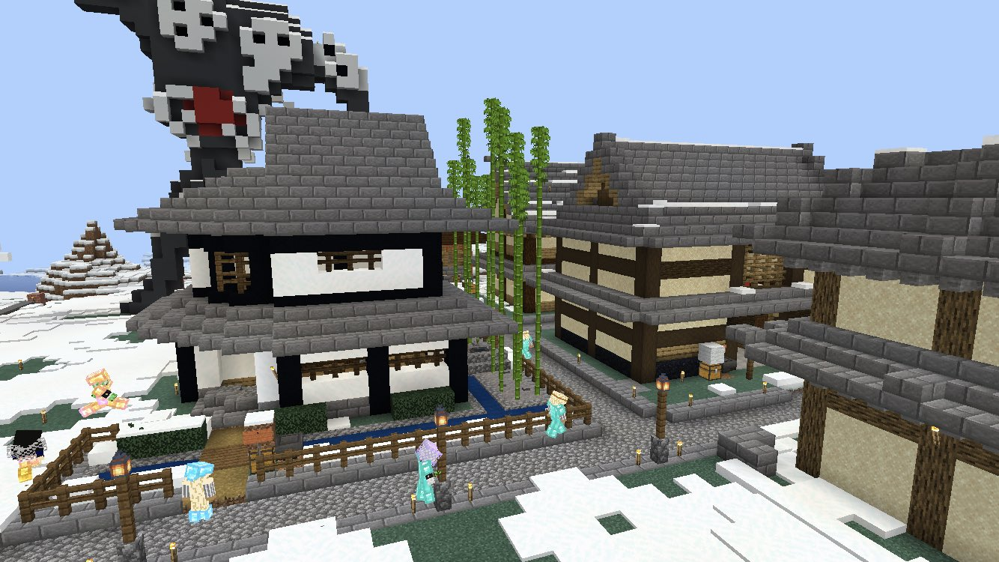
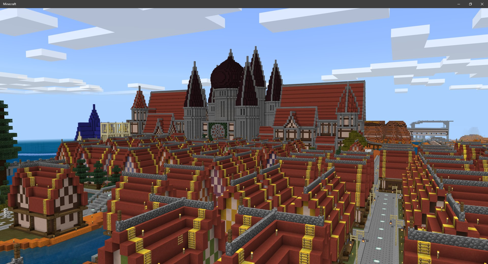
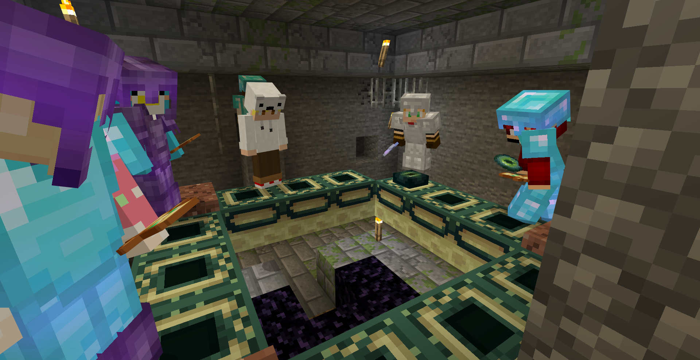
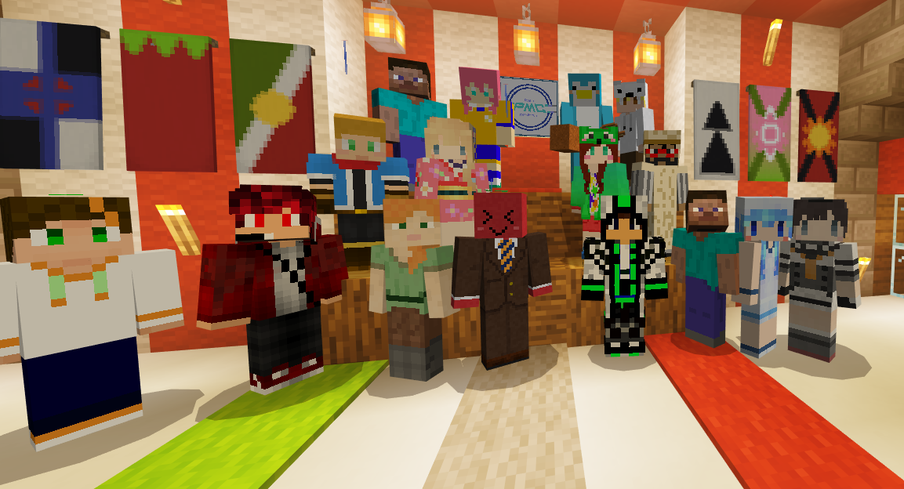

# PostMineClanについて

## 好きなものが創れる世界

PostMineClanは2019年からつづくMinecraftコミュニティです。7年間ほどの歴史を持ち、そのうえでみんな勝手に好きなことをやっています。鉄道を敷く人、砂漠に街をつくる人、花火にダイヤを溶かす人。各自が自律的に遊びながらゆるく交流できる土台を、我々は年月かけて醸成してきました。

## 7年、6つの世界

ワールドが重くなったり遊び方を変えたくなると、世界ごと作り直します。今のワールドで6代目。飽きたら建て直せばいいので、7年途切れずに続いています。統合版、Java版、mod導入も試しましたが、現在は統合版のサバイバルマルチプレイに落ち着いています。

<small>はじまりはどこにでもあるRealmsでした。</small>

初代ワールドには総延長1万マス超の鉄道網がありました。色分けされた路線が走り、駅ごとに砂漠・温泉・メサと雰囲気の違う街が点在します。乗り継いであちこちめぐれました。

  
  
  

## 名前の由来

昔、[MINECLAN](https://x.com/search?q=%40mineclan_realms)というMinecraftサーバーがありました（2016.11.20-2018末）。そこから何人かで飛び出して立ち上げたのがPostMineClanです。MINECLANの後継、という意味の名前です。

## みんなで遊ぶ

中心はMinecraftですが、ApexやSplatoon、Tarkov、気になったSteamゲームも一緒に遊びます。Minecraftでは季節や思いつきでイベントを開きます。神社の上で年越し、和風建築やひな祭りのコンテスト、アスレチック大会など。建築コンテストは名物です。エンダードラゴンは毎回みんなで討伐に行きます。

ボイスチャットを覗いたりイベントに飛び込んだりすると、すぐ馴染めます。

## 参加について

PostMineClanは審査制です。

高校生以上、10代後半から20代が中心。 
スマホかパソコンでBedrock版を遊べる方が対象です（他機種でも外部サーバーに入れる環境があればOK）。 

ゲームの腕前は問いません。いっしょに楽しめるか、その点のみを重視しています。

それでは、皆さまと一緒にマインクラフトの世界で楽しめる日を心待ちにしております。

 

<a href="https://forms.gle/nAfeagxWa9JFMWHw5" style="display:inline-block; padding:12px 28px; background:#3b9dc4; color:#fff; font-size:1.3em; font-weight:bold; border-radius:8px; text-decoration:none;">応募はこちら</a>

