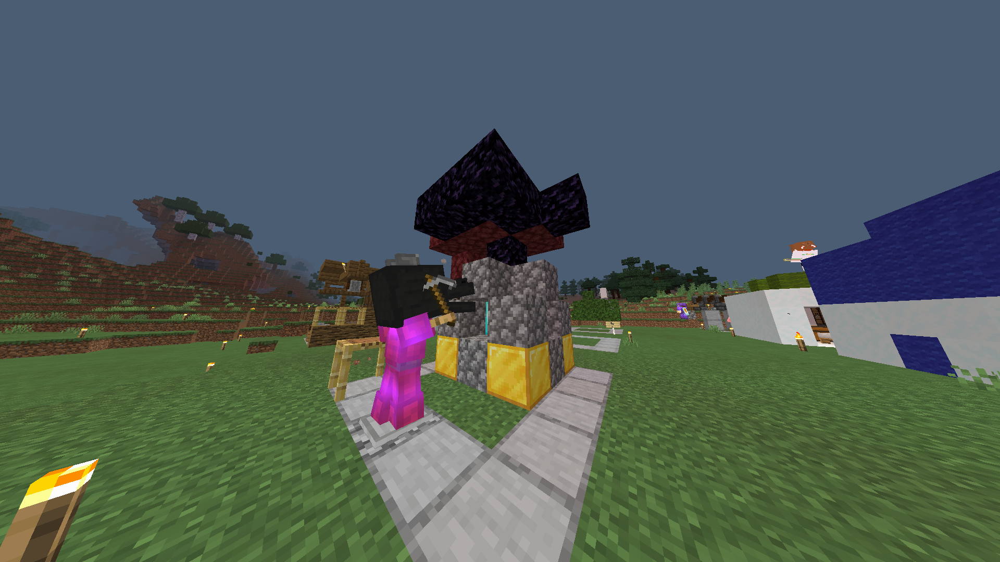
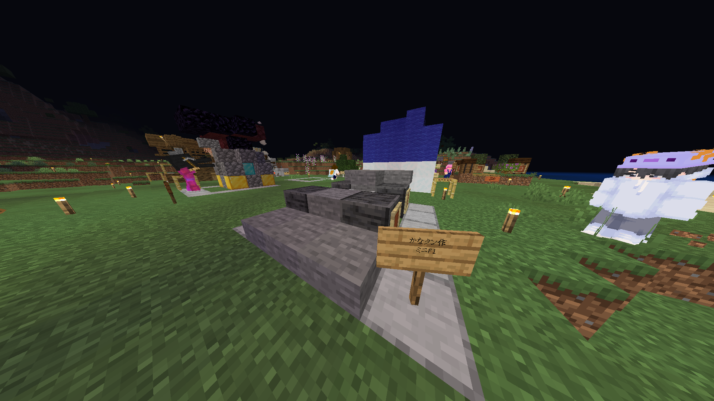
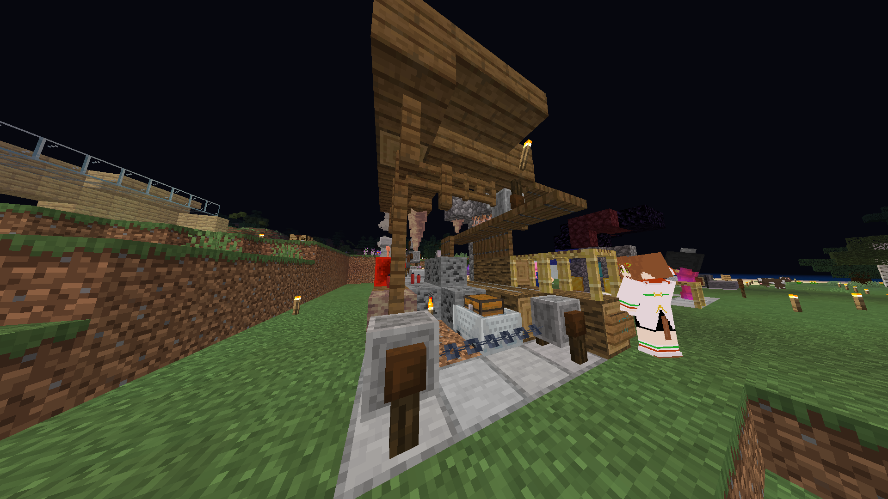
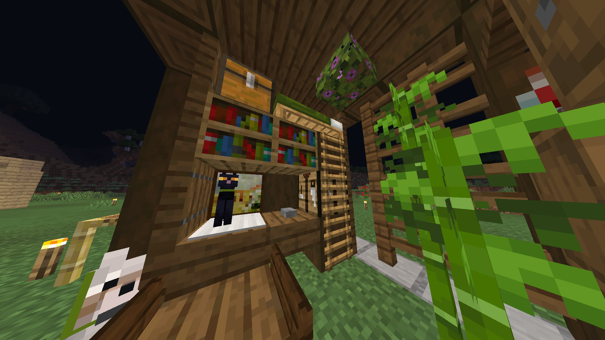
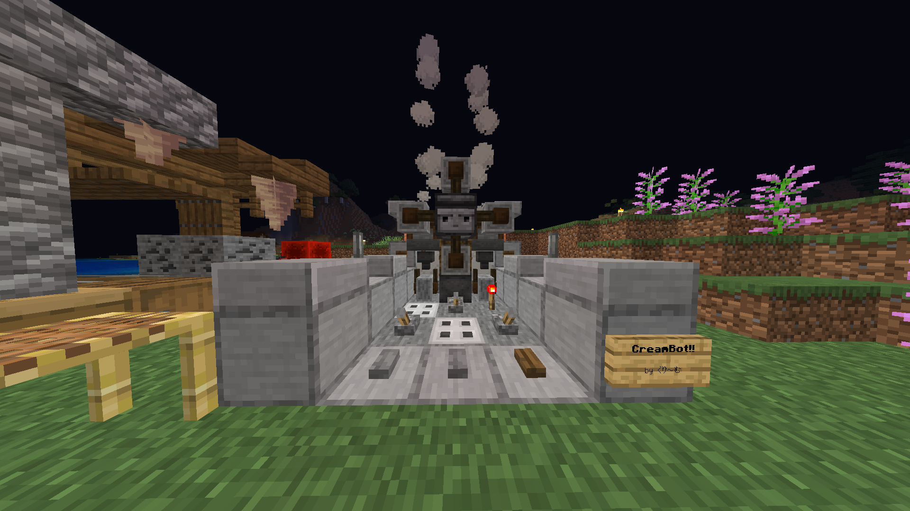
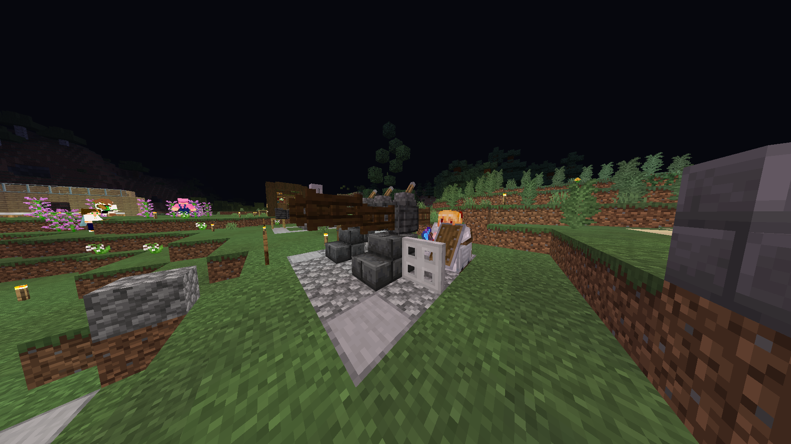
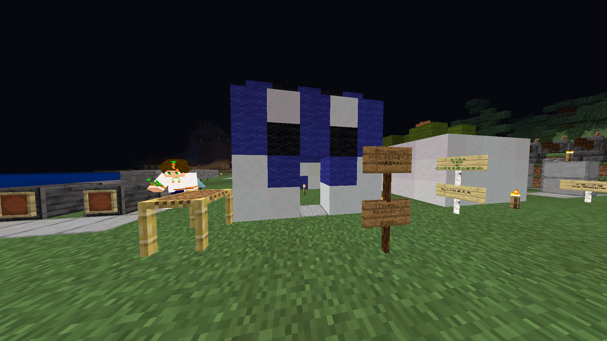
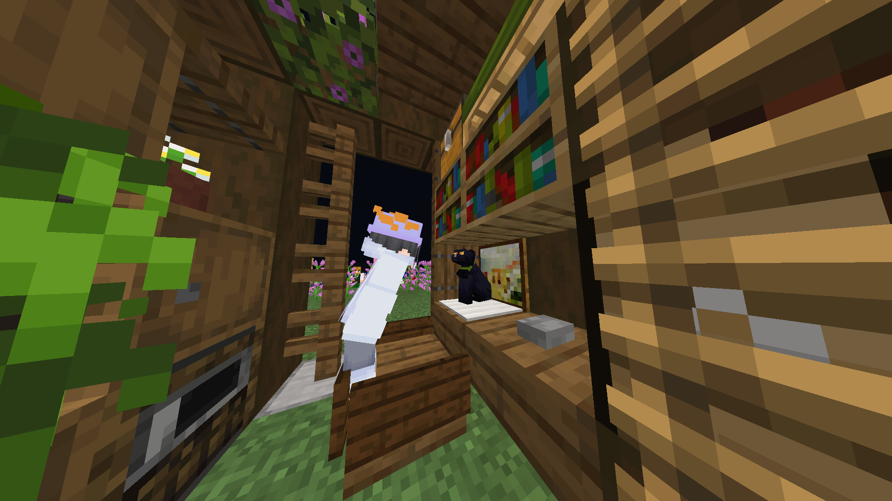

2月の頭から26日までの間で開催された「ミニマム建築コンテスト」の授賞式を行いました。
ミニマム建築コンテストは、5×5×5の範囲という制約の中でいかにクオリティの高い物を製作できるかを
競うコンテストです。今回は11作品の中から7作品が賞を受賞しました。

# アイディア賞
優れたアイディアの建築に送られた賞

### どなべ作「領域展開」

**作者コメント:** 
`ミニマム建築と聞いたときに真っ先に思い浮かんだのがこの仮ネザーでした。懐かしさを感じるとともに、起動したときの壮大さを5×5×5ブロックの空間に詰め込みました`

### かなタン作「ミニF1」  

**作者コメント:** 
`思い付きと衝動で作りましたF1は詳しく知りません`

# クオリティ賞
クオリティの高い建築に送られる賞

### シュガー作「ミニ炭鉱」

**作者コメント:** 
`サイズが小さいけど欲張って詰め込みました`

### はんちゃん作「サバイバルリモートワーク」

**作者コメント:** 
`自然を感じながら在宅ワークしてみませんか？`

### Cream作「CreamBot!!」

**作者コメント:** 
`最もスモールに最もビッグなものを作りました。`

# ラブ賞
愛が感じられる（？）作品に送られる賞

### ヒョコ作「25mm3連装機関銃」

**作者コメント:** 
`ファントム絶対撃墜するファントム絶対撃墜する꜀ (ﾟ∀｡) ꜆`

### ちもちー作 「タマザラシ」

**作者コメント:** 

# モストミニマム賞
スポンサーのもみさんが選定した、最も少ないブロックで構成された作品に与えられる賞。略称はモミ賞。

### かなタン作「ミニF1」  

__ダブル受賞!!__

# グランプリ
そして...栄えあるグランプリ作品は...
 
 
 
 

### はんちゃん作「サバイバルリモートワーク」

__はんちゃんおめでとうございます！！__
 
 

ミニマム建築コンテストに参加してくださった皆さん、ありがとうございました。

_Written by Donabe_
