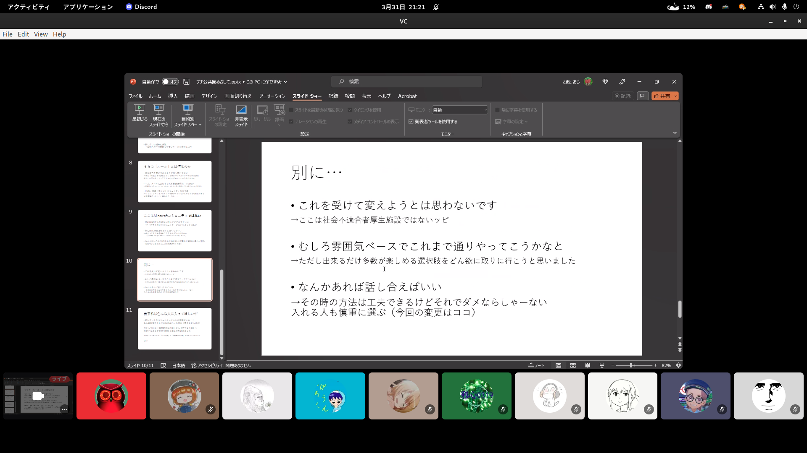
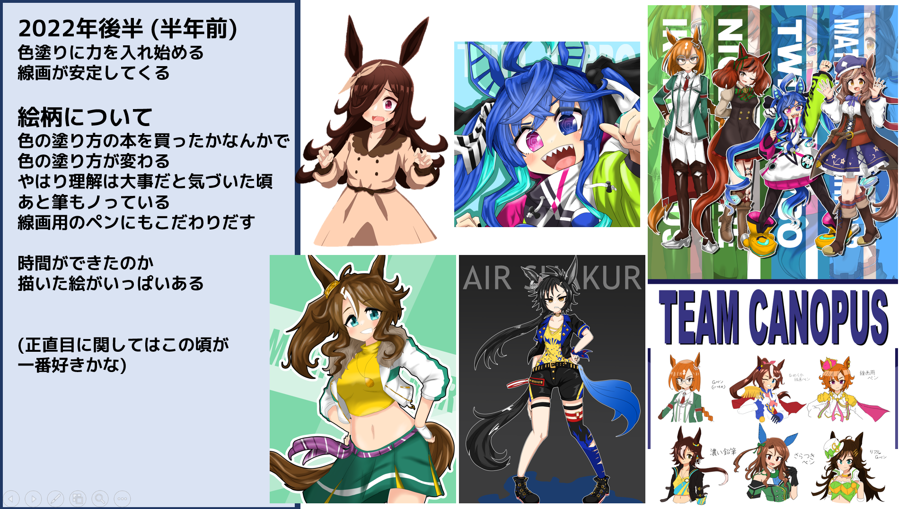
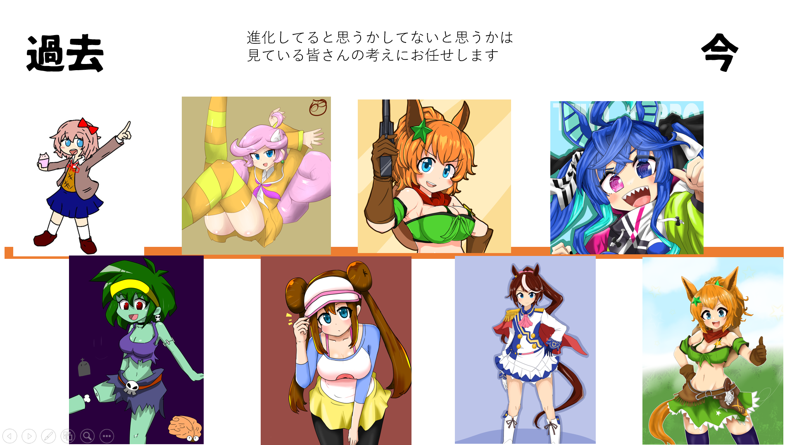

2022年3月31日、第三回の好きなものプレゼン会を行いました。テーマは柔道、ゲームにおける影の付け方、サーバーのポリシー、イラスト講座など、幅広い分野にわたっています。

## どんなイベント？

当イベントでは、参加者たちがそれぞれ異なる趣味や関心を共有し、世界が広がる貴重な体験ができました。みんなが自分の知識や技術を披露し、他の参加者と情報交換できる楽しい場となりました。質疑応答も交え、より深い理解を得たり、メンバー同士の交流や、プレゼンの手法についてのフィードバックなども行われました。

## 予告

次回のイベントでは、テーマを設定して、さらに多様な分野をカバーする予定です。新しい趣味や関心を見つけ、互いに学び合う機会を提供することで、コミュニティがより強固になることを期待しています。

興味のある方はぜひPMCの見学においでください！
詳細は追ってお知らせいたします。お楽しみに！