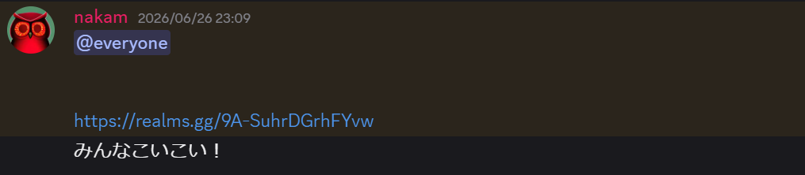

 

こんにちは。マスターのなかむです。
この度、2024年～2025年度は5.0をやったり休止していたりと活動も下火になっていましたが、ここで6.0を立ち上げて再スタートを切ることにしました。

きっかけは些細なことでした。<small>本当に些細なことでした。</small>

 

## 燻る

2024年から2025年のPostMineClanは、単なる雑談グループになっていました。
なかむは留学に出かけたのち、2023年の中頃から調子を崩したことで実質的に運営をしばらく離れ、サーバーの勢いは失速し、PostMineClan 1.0の盛況を忘れられないまま5.0も立ち上がったものの、結果modによるテクノロジーを楽しむ程度に留まってしまいました（この流れを汲んで現在の[PMC ANNEX](https://pmchp.pages.dev/posts/pmc_annex/)が発足しました）。

 

そのまま運営をしばらく離れていたことで、PostMineClanは、2年弱にわたって緩やかな雑談で時の流れを過ごしました。
その間、なかむ本人の人生も青春の色を失い、灰色になっていくような気がしていました。この時曲を書いたり旅行に行ったりで様々な趣味に手を出していたのですが、居心地の良い場所、となるとどうも探すのが難しいのでした。

 

## 色めき立つ

2026年の5月末、なかむには最近知り合って仲の良い女性がいました。これをPostMineClanのDiscordに何気ない雑談として投稿したところ、普段は反応のないメンバーから思いがけない反応を得て、それからDiscord内で、にわかに活気が戻りました。

結果的になかむは失恋するに至ったのですが、このDiscordの勢いを見るに、何かまた遊べないかな、当時の賑わいがもう一度みたいな、と思うようになりました。

 

## 追い風

さらに、普段は関西に住んでいるメンバーが東京に遊びに来るという話があり、では皆が最近どうしているか近況でも聞こう、ということになり東京都内で飲み会を開きました。これがきっかけになり、意外にもみんなマインクラフトを今でも遊んでいることがわかり、それでは試しにPostMineClanを再始動させてみよう、という話になり、勢いでRealmsを立てました。

<small>本当に勢いで立った↓</small>

___

PostMineClan 6.0は、当時たしかに感じ取った「一緒に遊ぶ」楽しさをもう一度感じ取るプロジェクトになります。 
マインクラフトで、各々が好きなことをして、交流しつつ、誰かと一緒に遊ぶ楽しさを思い出すことができれば、PostMineClan 6.0を立ち上げた甲斐もあります。

 

みなさんも、いっしょに遊びましょ。 
[参加はこちら](https://pmchp.pages.dev/about_us/)から。