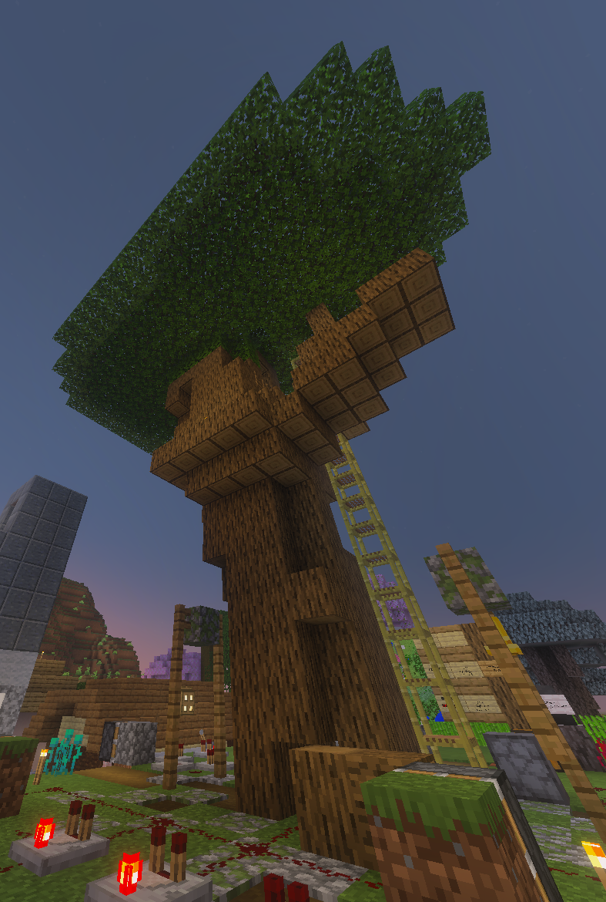
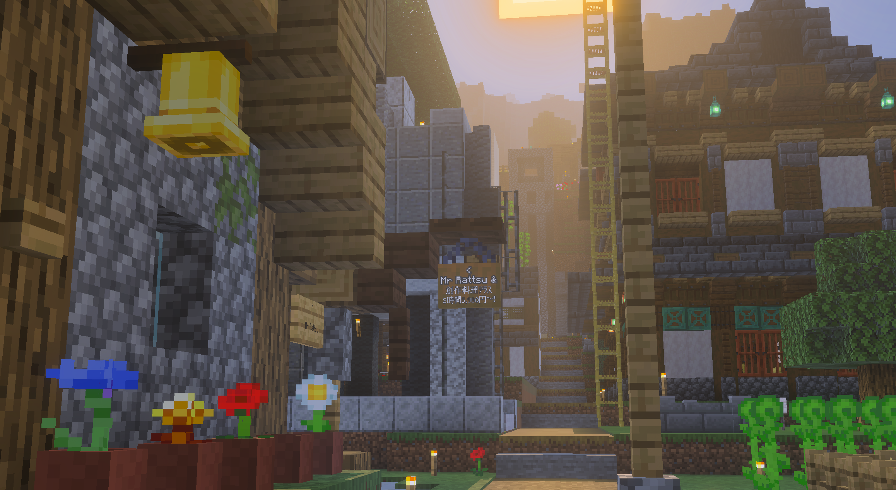
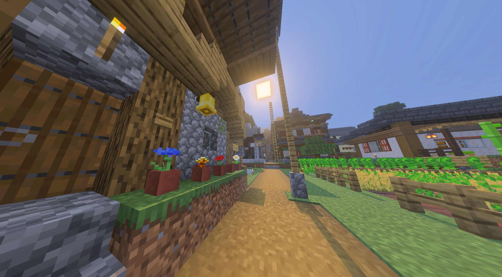

エンダードラゴン討伐・花火大会の日程が決まりました。
エンドラ討伐がんばるぞ！花火大会もがんばるぞー！

エンドラ討伐は一回だけやったことありますが、ノーマルでテキトウにゾン凸（*1）でなんとか倒した程度なので、ハードで戦いに行くとなると多少の緊張が走ります。数日前はサーバーで放置した鉄、カボチャ、スイカを思いっきり使って交易で装備を錬成していました。肝心なのは諦めです。ちょうど確認した時点ではこのサーバーのプレイ日数は2679日ですが、これくらいプレイしていると流石にネザライト装備の一式が揃います。しかし問題はこのネザライト装備がなくなったら？ということで、ネザライト装備一式にやる気の全てが懸かっているという状況は危ない。安心してマインクラフトを進めるためにも急いで予備のネザライト装備を作りました。これで無事エンダードラゴンとの死闘の末奈落に落ちたりしても、その日づけでマインクラフトを引退せずに済みます。
なお、この間、ほかの人も安心して戦えるようにエンチャント済みダイヤ装備一式をいくつかと、鉄装備一式をいくつか作りました。PostMineClanが久しぶり、という方にもぜひ遊びに来てほしいですね。

さて、29日に花火大会を予定しているのですが、回路は苦手にも関わらず花火を打ち上げる回路を話の流れで引き受けてしまったのでうんうん唸りながら作りました。クロック回路を組むにも一大事業です。

ところでシロクマが花火を打ち上げる広場の中心に大きな木（神樹様）を作っていて、あららここは打ち上げ用のフィールドとして確保したのに……これは場合によっては切り倒さないといけないのかなあとハラハラしていたものの、最終的にこの木の上にのぼって花火を鑑賞した方がむしろ綺麗でよいという話に落ち着いた。偶然ながらも、彼の努力が報われる形で事が運んで何よりでした。こちらの写真が神樹様です。

___

ところで、視野角の話をちょっとしたいです。
マインクラフトにはビデオ設定のひとつに「視野角」というものがありまして、見え方を調整することができます。
デフォルトは60度に設定されており、30度～110度の間で調整することが出来る。
これはどれだけキャラに対して寄りー引きで見ているのか、というのを表す数字、というのが適切なのかなと思います。

写真で比較してみましょう。ここは今みんなで住んでいる場所の一角を写真に撮ったもの。
こちらは30度です。

このように30度にすると猛烈に画面が狭くなるため、PVPや切迫した状況にいて広く視野を持ちたい方にはおすすめできません。しかし、これがどうも一眼で写真を撮る時の画角に似ているような気がして、最近マインクラフトの写真、特に建築のそれを撮る時には30度に落としたくなります。

では、一方で最大限の広角、110度にまで上げてみますと……

ただし普段なかむは60度で遊んでいるため、あんまりにも視野角を広くすると画面酔いする。
今までゲーム実況動画等で、早送りにした映像を流すさい酔い止めとして静止画を流す演出を見ては何の意味があるのだろうと効果を実感せずにいたのだが、猛烈に酔い止めの静止画が中央に欲しい。

という感じでした。60度の写真を撮っていませんでしたね。皆さんもお試しください。

>*1 死んではエンド要塞で蘇生して、何度も攻撃に行くことでダメージを与える、デス前提の攻撃方法。